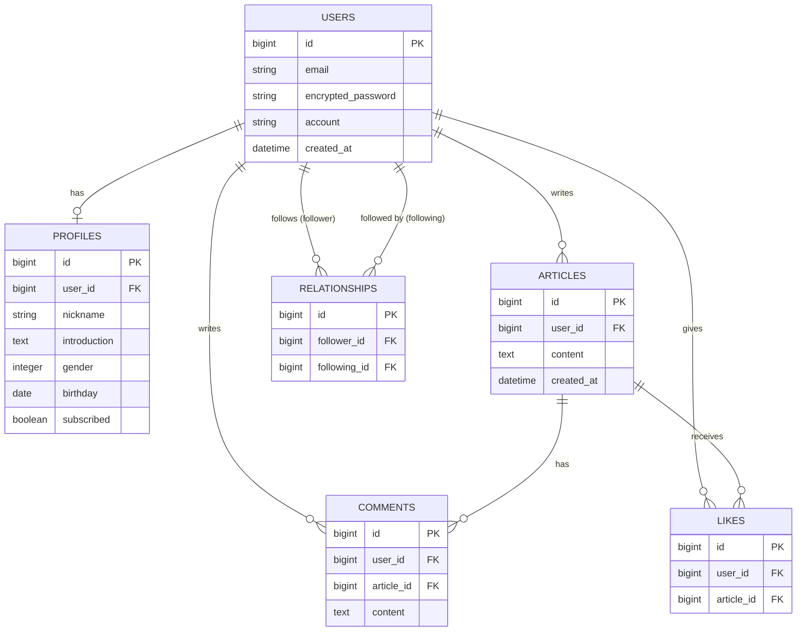
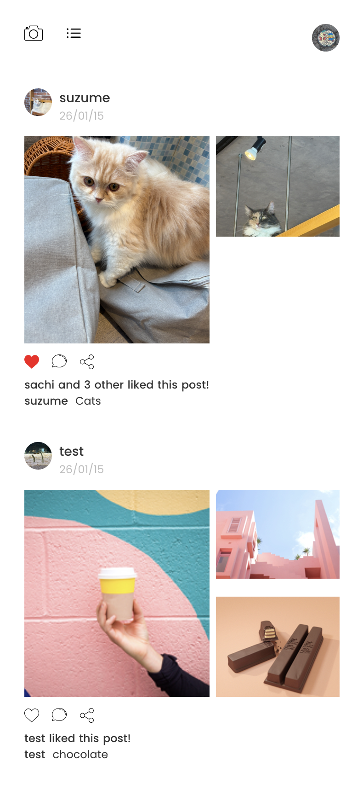
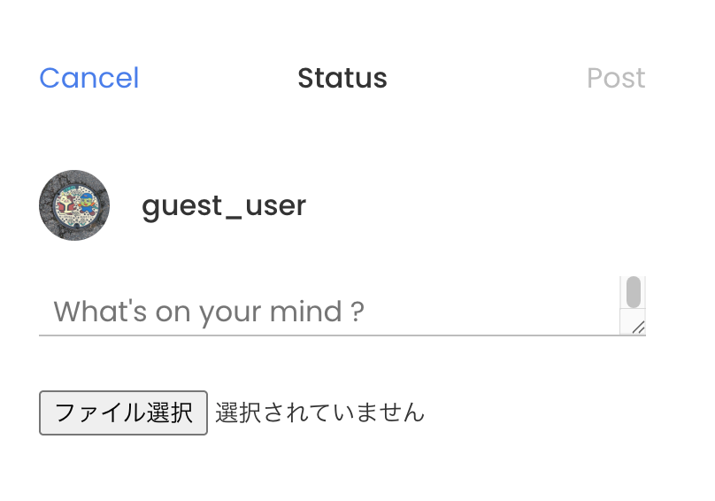
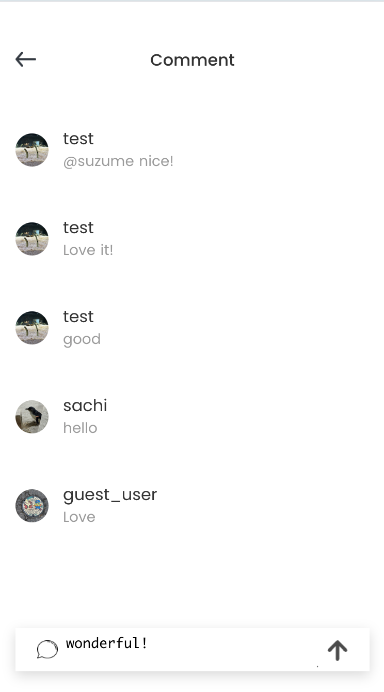
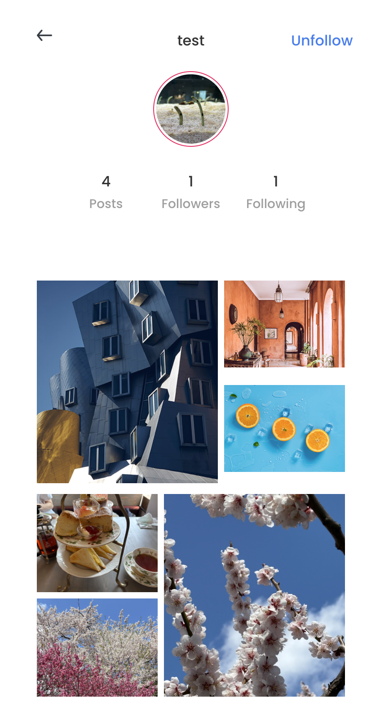

# Instagram風アプリ

<a href="https://sankaku-instagram-like-app-1748b8f8cf08.herokuapp.com/" target="_blank" rel="noopener noreferrer">アプリへのリンク</a>

## このアプリについて

スクールの課題として作成したInstagram風アプリです。 
課題は要件とデザインが提示されるのみで手本のコードはなく、自分で考えて設計・実装する形式でした。 
画像と本文の投稿機能、いいね・フォロー機能、タイムライン表示などを実装しています。

## 主な使用技術

 
## アプリ機能

| 機能           | 詳細                                                                                                                                                                                                         |
| -------------- | ------------------------------------------------------------------------------------------------------------------------------------------------------------------------------------------------------------ |
| 記事投稿     | 写真とテキストを投稿できる。写真は3枚まで対応。                                                                                                             |
| いいね       | 記事ごとに「いいね」を付与できる。                                                                                                                                                           |
| コメント       | 記事にコメントを投稿できる。 「＠ユーザー名」でメンションすると相手の登録E-mailに通知される。                                                                                                                                                           |
| シェア       | 自分のXに記事をシェアできる。                                                                                                                                                        |
| フォロー    | 特定のユーザーをフォローできる。フォローしたユーザーの投稿はタイムラインにに表示される。         
| タイムライン | フォローしているユーザーの投稿と、24時間以内に作成された投稿の中で「いいね」が多い投稿を表示 |

 
    
## データベース設計

 

## 各機能の詳細

### 記事一覧・タイムライン

- 左上のリストボタン・ホームボタンで記事一覧とタイムライン表示を切り替え
- タイムラインにはフォローしているユーザーの投稿と、24時間以内に投稿された記事のなかでいいねが多いものを表示
- ハートボタンをクリックで「いいね」を付与・解除
- ふきだしボタンは投稿のコメントページへリンク
- シェアボタンで自分のXに記事をシェア
- 各記事のいいね数といいねをしたユーザーをランダムに表示
- 記事のユーザーアイコンからプロフィールへリンク

### 記事の投稿

- テキストと写真を投稿
- 写真はファイルを選択（複数選択可）

### コメント

- 記事に対しコメントを投稿できます。

### プロフィール

- 右上のボタンでフォロー・フォロー解除ができます。
- 自分のプロフィールの場合、アバター画像をクリックすると画像の変更ができます。
- 投稿数、フォロー・フォロワー数、これまでの投稿写真が表示されます。
- フォロー・フォロワー数をクリックすると、その一覧が見れます。

